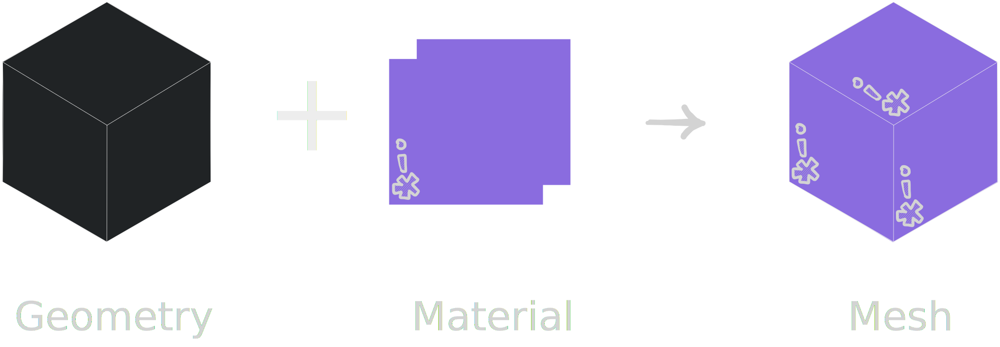
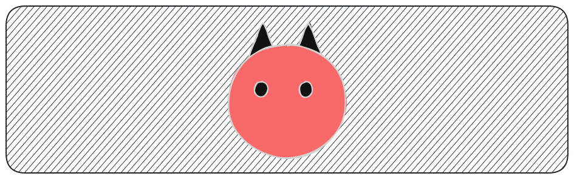

# Init React Three Fiber
Imagine creating 3D things for the web with the declarative nature of React. Sounds great, right?
Now, you don't have to read the first word again. Let me introduce you to React Three Fiber, which lets you do exactly that.

## What's React Three Fiber?
React Three Fiber aka R3F is a React renderer for Three.js. It takes JSX and renders it into Three.js, allowing you to create 3D scenes using declarative React components instead of writing imperative Three.js code.

To start building in 3D, we first need to understand a few fundamental concepts.

## Core Concepts
### Scene
A scene is a container holding all other things like objects, cameras, and lights.
Similar to a movie scene where we have the actors, cameras, and lights.

### Camera
A camera represents the viewpoint from which the scene is rendered.
It is what sees the scene and defines the view.

### Renderer
The renderer is responsible for rendering the scene onto a canvas. It renders the scene from the camera's point of view.

### Geometry
Geometry defines the shape and structure of an object.

### Material
Material determines the appearance of an object. It defines the surface of an object.

### Light
Light illuminates the scene. You can *light up* the scene with lights (pun intended).
<br>
**Note**: Some materials require light to be visible.

### Mesh
A mesh is a combination of geometry and material. It is any 3D object.



Now, let's put all these concepts to use by creating an adorable 3D monster.

## Scene Creation
Create a new React app. I'll use [Vite](https://vite.dev) and install Three.js along with React Three Fiber as dependencies.

```sh
# Create app
npm create vite@latest 3d-monster -- --template react

cd 3d-monster

# Install dependencies
npm install three @react-three/fiber

# Start development server
npm run dev
```

Remove the boilerplate code. Within the `src` folder, create a `components` directory along with a file named `Monster.jsx` inside it. Then, in `App.jsx`, import the `<Canvas />` component and add it inside the div with the id `canvas-container` within the `<App />` component.

Canvas is where the scene will be rendered. It sets up a scene and a camera and renders the scene every frame eliminating the need of traditional render-loop.

```jsx
import { Canvas } from '@react-three/fiber';
import './App.css';

const App = () => {
  return (
    <div id="canvas-container">
      <Canvas></Canvas>
    </div>
  );
};

export default App;
```

You won't see anything in the browser yet because the canvas is transparent by default. However, you can inspect it using the Developer Tools or by adding a background color to the canvas with CSS.
If you do that, you'll notice the canvas doesn't occupy the full available height of the webpage.

Canvas in R3F is responsive to fit the parent node so it takes the height and width of its parent container. To make canvas fill the entire height, set the div with the id `canvas-container` to take up the full viewport height. You can get rid of the default margin on the document body as well.

```css
/* App.css */
* {
  margin: 0;
  padding: 0;
  box-sizing: border-box;
}

#canvas-container {
  height: 100vh;
  background-color: #1b1b1b;
}
```

From the sketch of the monster shown below, you can see that it’s made up of circles and triangles. In a 3D world, that translates to spheres and cones.



Spheres and cones are 3D objects and if you think about it, any 3D object is a mere combination of two things - shape or geometry and material.
If you can recall from the core concepts section, that's exactly what a **mesh** is!
The way we create a 3D object is by creating a mesh using `<mesh />` , then wrapping the geometry and material components inside it.

```jsx
<mesh>
  <boxGeometry />
  <meshBasicMaterial />
</mesh>
```

`boxGeometry` and `meshBasicMaterial` are among the many built-in geometries and materials available. You can also create your own custom geometry and material.

These components map to the Three.js classes that you can create instances of.
The `<boxGeometry />` and `<meshBasicMaterial />` maps to `BoxGeometry` and `MeshBasicMaterial` in Three.js.  According to the R3F docs,

> The general rule is that Fiber components are available under the camel-case version of their name in three.js.

We can also set properties using props. And constructor arguments are always passed as an array via the `args` prop.
Setting any prop on a Fiber component, sets the property of the same name on the Three.js instance.

This code in React Three Fiber is equivalent to the following code in Three.js -

```jsx
// A mesh in React Three fiber
<mesh>
  <boxGeometry args={[1, 1, 1]} />
  <meshBasicMaterial color={0xff0000}/>
</mesh>
```

```js
// A mesh in Three.js
const geometry = new THREE.BoxGeometry(1, 1, 1);
const material = new THREE.MeshBasicMaterial({ color: 0xff0000 });
const mesh = new THREE.Mesh(geometry, material);
```
  
I won't be getting into the details of every geometry, material or any other components. I recommend keeping the [Three.js documentation](https://threejs.org/docs) handy so you can refer to it whenever you want to know more about the components.

That said, it's time to bring that monster from 2D to 3D.
To represent the body, use `sphereGeometry` with the `args` prop set to an array of three values - `radius`, `widthSegments`, and `heightSegments` and `meshStandardMaterial` with the `color` prop set to `red`.
The `widthSegments` and `heightSegments` determine how finely the sphere is subdivided. Higher values create a smoother-looking sphere by increasing the number of triangles.

```jsx
// Monster.jsx
const Sphere = () => {
  return (
    <mesh>
      <sphereGeometry args={[2, 64, 32]} />
      <meshStandardMaterial color="red" />
    </mesh>
  );
};

export const Monster = () => {
  return <Sphere />;
};
```

Next, import the component in `App.jsx`  and add it inside `<Canvas />` in the App component. 

```jsx
const App = () => {
  return (
    <div id="canvas-container">
      <Canvas>
        <Monster />
      </Canvas>
    </div>
  );
};
```
  
In the browser you can now see a...black sphere? 

Huh, strange! The `color` prop is set to `red`.

Well, there's a missing piece here.
What makes it possible to see objects in the dark? 

Light!...you need a source of light for the objects to become visible. The light needs to hit the objects and reflect back to your eyes for you to see them.

There are many different type of lights to choose from but for now, I'll go with `ambientLight` with the `intensity` set to `0.65`. This light evenly illuminates all objects in the scene. 

```jsx
<Canvas>
  <ambientLight intensity={0.65} />
  <Monster />
</Canvas>
```

A red sphere will now be rendered in the browser. 

Note there are materials like the `meshBasicMaterial` that are not affected by light.
Try changing the material to `meshBasicMaterial` and remove the light source.

By accepting `args` and `color` as props, the `Sphere` component can be used to represent eyes as well. Similarly, we can represent horns using a `coneGeometry`.

```jsx
const Sphere = ({ args, color }) => {
  return (
    <mesh>
      <sphereGeometry args={args} />
      <meshStandardMaterial color={color} />
    </mesh>
  );
};

const Cone = ({ args, color }) => {
  return (
    <mesh>
      <coneGeometry args={args} />
      <meshStandardMaterial color={color} />
    </mesh>
  );
};

export const Monster = () => {
  return (
    <>
      <Sphere args={[2, 64, 32]} color="red" />
      <Sphere args={[0.1]} color="black" />
      <Sphere args={[0.1]} color="black" />
      <Cone args={[1.2, 5]} color="black" />
      <Cone args={[1.2, 5]} color="black" />
    </>
  );
};
```

Things are still not how we want them to be. That's because everything is rendered at the default position i.e. (0, 0, 0). To positioned things, set the `position` prop on the `<mesh />`.
Move them around, play with the values such that the final arrangement looks like the 2D monster we saw earlier.

To enhance the scene, I'll add one more light source called `spotLight` and also set the `roughness` prop to give a glossy, mirror-like look to the eyes and horns.

Since `Sphere` and `Cone` differ only in their geometry and share the same implementation otherwise, we can refactor them into a single reusable component.

```jsx
// Monster.jsx
const Object = ({ geometry, args, color, position = [0, 0, 0], roughness = 1 }) => {
  return (
    <mesh position={position}>
      {geometry === "sphere" && <sphereGeometry args={args} />}
      {geometry === "cone" && <coneGeometry args={args} />}
      <meshStandardMaterial color={color} roughness={roughness} />
    </mesh>
  );
};

export const Monster = () => {
  return (
    <>
      <Object geometry="sphere" args={[2, 64, 32]} color="red" />
      <Object geometry="sphere" args={[0.1]} color="black" position={[0.4, 0.2, 3]} roughness={0} />
      <Object geometry="sphere" args={[0.1]} color="black" position={[-0.4, 0.2, 3]} roughness={0} />
      <Object geometry="cone" args={[1.2, 5]} color="black" position={[2, 2, -3]} roughness={0} />
      <Object geometry="cone" args={[1.2, 5]} color="black" position={[-2, 2, -3]} roughness={0} />
    </>
  );
};
```

```jsx
// App.jsx
const App = () => {
  return (
    <div id="canvas-container">
      <Canvas>
        <ambientLight intensity={0.65} />
        <spotLight position={[60, 60, 30]} />
        <Monster />
      </Canvas>
    </div>
  );
};
```

The scene looks good but no one would know that its an arrangement of some 3D shapes.
The rendered view represents the scene from the camera’s point of view. The view see on the screen is exactly what the camera sees and it can be changed by controlling the camera.

Unfortunately, React Three Fiber itself does not include built-in camera controls for interactively inspecting a scene. 

I'll be using [Drei](https://drei.docs.pmnd.rs/getting-started/introduction),  a growing collection of useful helpers and abstractions for R3F.
Drei exports `OrbitControls` , a camera controller that allows to orbit, zoom and pan around the scene. Add the `<OrbitControls />` component inside the `<Canvas />` and limit how far the camera can zoom out using the `maxDistance` prop.

```jsx
<Canvas>
  <OrbitControls maxDistance={5} />
</Canvas>
```

To bring more life to the scene, let's add one last thing - `Environment`, another helper provided by Drei. It uses a pre-generated HDR environment map - a 360-degree image that captures the lighting information from the real world or a virtual environment. This map is then used to create realistic reflections and lighting effects on objects in the scene. It can also be used as the scene background.
I'll use one of the available presets and add the `background` prop to use it as the background.

```jsx
<Canvas>
  <ambientLight intensity={0.65} />
  <spotLight position={[60, 60, 30]} />
  <Monster />
  <OrbitControls maxDistance={5} />
  <Environment preset="night" background />
</Canvas>
```
[Take a look at the scene.](https://ruchita1010.github.io/3d-monster)

There’s still much to explore in R3F, so have fun! Maybe play around with the code and create a different monster or just anything using some shapes! If you do, I would love to see! Feel free to tag me in the posts on Twitter or LinkedIn :D

'Til then （￣︶￣）↗
